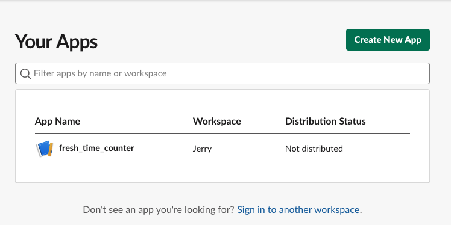
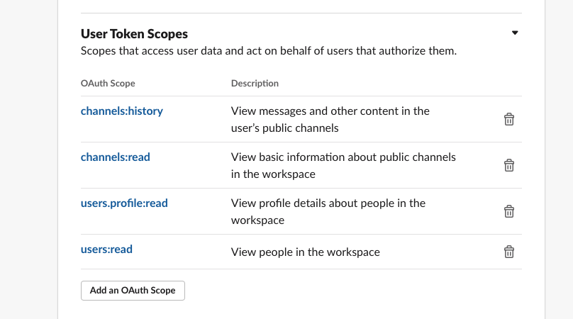
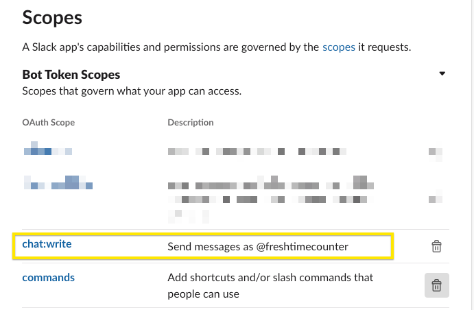
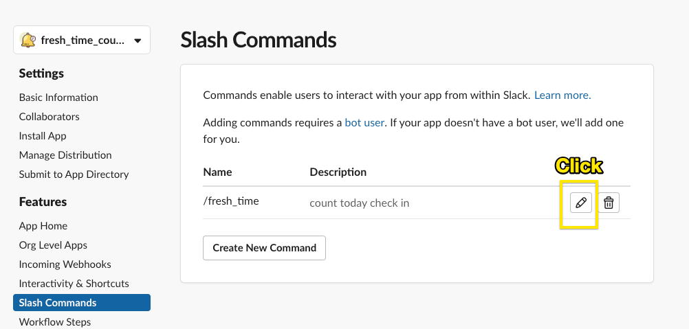
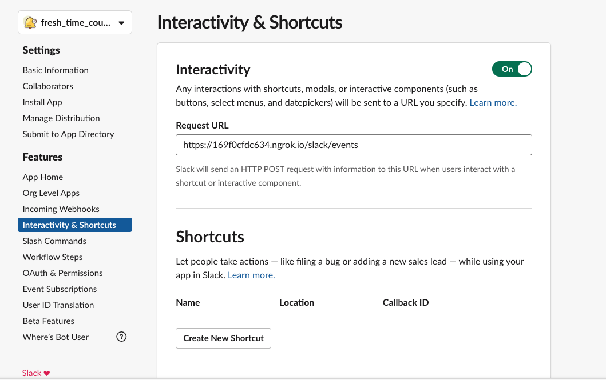

## Result


## Deployment Steps on AWS Lightsail

- Lightsail: `Freshworks-SlackApps`
- Click on `connecting ssh`

```bash
## cd to the root folder
$ cd slack-apps/freshworks-fresh_times-counter

## if you have new update (and make sure you update git remote url, as it's currently pointing to my repo)
$ git pull
```

- Update to new docker image (under `slack-apps/freshworks-fresh_times-counter`)

```bash
## Stop and remove container
$ docker stop freshtimes
$ docker rm freshtimes

## Build new image
$ docker build -t freshtimes .
$ docker run -d -p 8888:8888 -name freshtimes freshtimes
```

## usage

#### create new app

https://api.slack.com/apps


- Adding scope in OAuth & Permissions



#### slash command


#### type `/fresh_time` in the channel you want to count


## slack api

#### fetch all users info in slack

https://api.slack.com/methods/users.list

#### fetch all message in channel

https://api.slack.com/methods/conversations.history

#### fetch all members in channel

https://api.slack.com/methods/conversations.members


## Deploy to AWS Lightsail

- open the port 8888


## Refs

https://scotch.io/tutorials/create-a-custom-slack-slash-command-with-nodejs-and-express

---

# V2.0

## Key Steps

#### Add permission and scope

- Add file `.env`

```bash
cp .env-example .env
```

```bash
API_TOKEN=  // Under OAuth Permission, OAuth Access Token
SLACK_BOT_TOKEN= // Under OAuth Permission, Bot User OAuth Access Token
SLACK_SIGNING_SECRET=  // Under Basic Information
PORT= // whatever you want the port
```


- Add `chat:write` to the bot scope



- Add path `/slack/events` to `Request URL` under `Slash Commands`.




- Activate `Interactive and shorcuts` and Add path `/slack/events` to `Request URL`.
  


## Refs

- [Block Kit Builder](https://app.slack.com/block-kit-builder)

- https://github.com/seratch/bolt-starter

- https://slack.com/intl/en-ca/slack-tips/workflow-builder-examples

### Issues

- https://github.com/slackapi/bolt-js/issues/490
